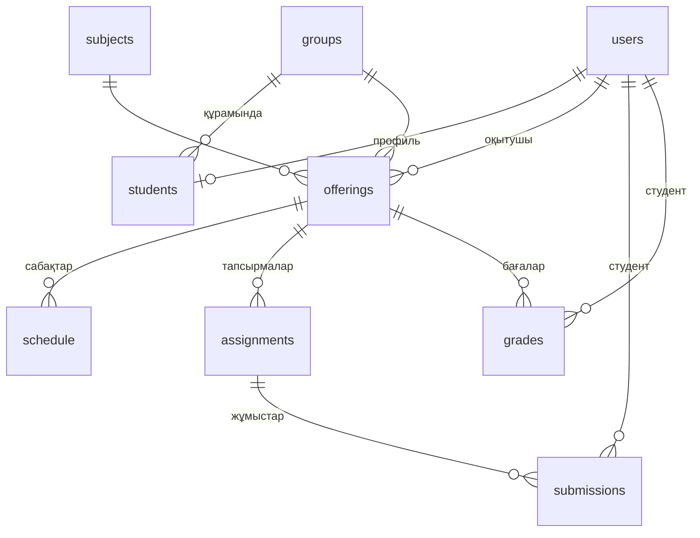

# Platonus — оқу порталы (прототип)

Platonus жүйесінің негізгі модульдерін қайта жобалаған жұмыс істейтін веб-қосымша.

**Стек:** Python 3.10+ · Flask (REST API) · SQLite (реляциялық дерекқор, Foreign Keys қосулы) · таза HTML/CSS/JS (framework-сіз SPA).

## Іске қосу

```bash
cd backend
pip install -r requirements.txt
python app.py
```

Браузерде ашыңыз: **http://localhost:5000**

Алғашқы іске қосуда `platonus.db` автоматты жасалып, демо-деректермен толтырылады.
Ескі `platonus.db` болса, жаңа бағандар (`approved`, `email`, `phone`, `department`, `position`, `bio`) іске қосуда автоматты қосылады. Дерекқорды нөлден бастау үшін `backend/platonus.db` файлын жойып, серверді қайта іске қосыңыз.

### Демо-аккаунттар

| Рөл       | Логин      | Құпиясөз     |
|-----------|------------|--------------|
| Әкімші    | `admin`    | `admin123`   |
| Оқытушы   | `teacher1` (`teacher2`, `teacher3`) | `teacher123` |
| Студент   | `student1` … `student6` | `student123` |

> Бұл — тек демо үшін. Нақты қолданбас бұрын құпиясөздерді өзгертіңіз.

### Орта айнымалылары (міндетті емес)

| Айнымалы | Мағынасы |
|----------|----------|
| `PLATONUS_SECRET` | Токенге қол қоятын құпия кілт (берілмесе `backend/.secret_key` жасалады) |
| `PLATONUS_DB` | SQLite файл жолы |
| `PLATONUS_UPLOADS` | Жүктелген файлдар папкасы |
| `PORT` | Сервер порты (әдепкі 5000) |

## Функционал

| Модуль | Мүмкіндіктер |
|--------|--------------|
| **Тіркелу** | Кіру бетіндегі «Тіркелу» сілтемесі. Студент топты таңдап тіркеледі, аккаунт бірден ашылады. Оқытушы тіркелгенде аккаунт «растау күтуде» күйінде болады, әкімші профилінен (немесе «Қолданушылар» бөлімінен) растайды не қабылдамайды. Әкімші тек әкімші арқылы жасалады (өздігінен тіркелуге болмайды). Спамнан қорғау: бір IP-ден сағатына 10 тіркелу. |
| **Авторизация** | Студент / оқытушы / әкімші рөлдері. Құпиясөздер `scrypt` арқылы hash күйінде сақталады (`werkzeug.security`). Қол қойылған токен (12 сағат), қате кіру әрекетінің шектеуі (5 әрекет → 1 минут бұғат), құпиясөз ауыстыру. |
| **Сабақ кестесі** | Апталық тақта: уақыты, аудиториясы, түрі, оқытушы/топ. Студент өз тобының, оқытушы өз сабақтарының кестесін көреді. Бүгінгі күн белгіленеді. |
| **Тапсырмалар** | Оқытушы тапсырма қосады (мерзімімен), тапсырылған жұмыстарды көреді және жүктеп алады. Студент PDF/ZIP/DOCX жүктейді, қайта жүктей алады. |
| **Ағымдағы журнал** | Студент: 1-аралық, 2-аралық, қорытынды, жиынтық және әріптік баға. Оқытушы: топ бойынша баға қояды (жиынтық live есептеледі). Жиынтық = 30% + 30% + 40%. |
| **Жеке профиль** | Әр рөлдің жеке беті: дерек өзгерту (аты-жөні, email, телефон, кафедра, лауазым, өзім туралы), құпиясөз ауыстыру. **Оқытушы:** топ/студент/тапсырма/түскен жұмыс саны, бүгінгі сабақтар, пәндер тізімі. **Әкімші:** жүйе статистикасы және тіркелу сұраулары (растау / қабылдамау). Әкімші мен оқытушы жүйеге кіргенде профиль бетіне түседі. |
| **Админ панелі** | Қолданушыларды қосу/өңдеу/бұғаттау/жою, топтар мен пәндерді басқару, оқытушыны пән мен топқа бекіту, кестеге сабақ қосу. |

## Қауіпсіздік шаралары

- Құпиясөз ешқашан ашық күйде сақталмайды; логин қатесінде «логин/құпиясөз қате» деген бірдей жауап беріледі (қолданушы бар-жоғы жасырын).
- Әр endpoint рөлді сервер жағында тексереді (студент админ API-ін шақыра алмайды, оқытушы басқа оқытушының жұмысын көре алмайды).
- Файл жүктеу: кеңейтілім (`pdf`, `zip`, `docx`) **және** файлдың бастапқы байттары (magic bytes) тексеріледі, максимум 15 МБ. Файлдар `uuid` атауымен сақталады, түпнұсқа атауы дерекқорда.
- SQL сұраныстары параметрленген (SQL injection жоқ), интерфейсте барлық деректер HTML-escape арқылы шығарылады (XSS қорғанысы).
- Кестедегі конфликт тексеріледі: бір уақытта бір аудитория / оқытушы / топ қайталанбайды.

## Дерекқор схемасы (ER)



Барлық байланыстар `FOREIGN KEY` арқылы жүзеге асқан (`schema.sql`):
- Қолданушыны жойса — оның студент профилі, жұмыстары, бағалары каскадты жойылады (`ON DELETE CASCADE`).
- Оқытушыны, топты, пәнді жүктемеде қолданылып тұрғанда жою мүмкін емес (`ON DELETE RESTRICT`) — API түсінікті қате қайтарады.
- `CHECK` шектеулері: рөл, баға 0–100, апта күні 1–7, басталу < аяқталу уақыты; `UNIQUE`: бір студент бір тапсырмаға бір жұмыс, бір пәнге бір түрлі бір баға.

## REST API

Барлық жауаптар JSON. Қорғалған маршруттарға `Authorization: Bearer <token>` тақырыбы қажет.

| Әдіс | URL | Рөл | Сипаттама |
|------|-----|-----|-----------|
| POST | `/api/auth/login` | — | Кіру → `{token, user}` |
| GET | `/api/auth/me` | барлығы | Ағымдағы қолданушы |
| POST | `/api/auth/register` | — | Тіркелу (`student` немесе `teacher`) |
| GET | `/api/public/groups` | — | Тіркелу формасына топтар тізімі |
| POST | `/api/auth/password` | барлығы | Құпиясөз өзгерту |
| GET/PUT | `/api/profile` | барлығы | Жеке профиль және рөлге сай статистика / деректі өзгерту |
| GET | `/api/schedule` | барлығы | Кесте (рөлге сай сүзіледі; әкімші `?group_id=`) |
| GET | `/api/assignments` | студент, оқытушы | Тапсырмалар тізімі |
| POST | `/api/assignments` | оқытушы | Тапсырма құру |
| DELETE | `/api/assignments/<id>` | оқытушы | Тапсырманы жою |
| GET | `/api/assignments/<id>/submissions` | оқытушы | Топтағы студенттердің жұмыстары |
| POST | `/api/assignments/<id>/submit` | студент | Файл жүктеу (`multipart/form-data`, өріс `file`) |
| GET | `/api/submissions/<id>/file` | иесі, оқытушы, әкімші | Файлды жүктеп алу |
| GET | `/api/journal` | студент | Өз бағалары |
| GET/PUT | `/api/offerings/<id>/grades` | оқытушы | Топ журналы / баға сақтау |
| GET | `/api/offerings` | оқытушы, әкімші | Пән жүктемелері |
| GET | `/api/admin/stats` | әкімші | Санақ |
| GET/POST | `/api/admin/users` | әкімші | Қолданушылар |
| POST | `/api/admin/users/<id>/approve` | әкімші | Тіркелген оқытушыны растау |
| PUT/DELETE | `/api/admin/users/<id>` | әкімші | Өңдеу (құпиясөз, топ, бұғаттау) / жою |
| GET/POST/PUT/DELETE | `/api/admin/groups[/<id>]` | әкімші | Топтар |
| GET/POST/PUT/DELETE | `/api/admin/subjects[/<id>]` | әкімші | Пәндер |
| GET/POST/DELETE | `/api/admin/offerings[/<id>]` | әкімші | Оқытушы–пән–топ жүктемесі |
| POST/DELETE | `/api/admin/schedule[/<id>]` | әкімші | Кесте сабақтары |

## Жоба құрылымы

```
platonus/
├── backend/
│   ├── app.py            # Flask REST API
│   ├── schema.sql        # кестелер мен Foreign Keys
│   ├── seed.py           # демо-деректер
│   └── requirements.txt
└── frontend/
    ├── index.html
    ├── css/style.css     # адаптивті стиль (desktop / tablet / mobile)
    └── js/app.js         # SPA: рөлдер бойынша көріністер, fetch → REST API
```

## Белгілі шектеулер (прототип)

- Уақыт сервердің жергілікті уақытымен жұмыс істейді (бір уақыт белдеуі).
- Токен браузердің `localStorage`-ында сақталады; өндірісте `HttpOnly` cookie + HTTPS қолданған дұрыс.
- Қате кіру санауышы жадта сақталады (сервер қайта қосылса нөлденеді).
- Сервер `python app.py` арқылы дамыту режимінде; өндіріс үшін `gunicorn` сияқты WSGI-сервер қолданыңыз.
